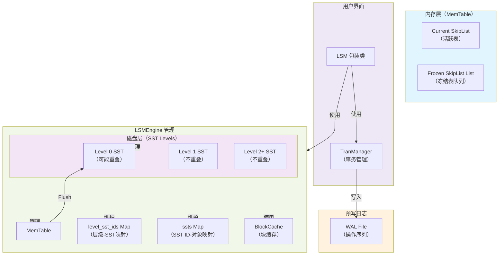
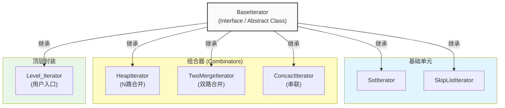
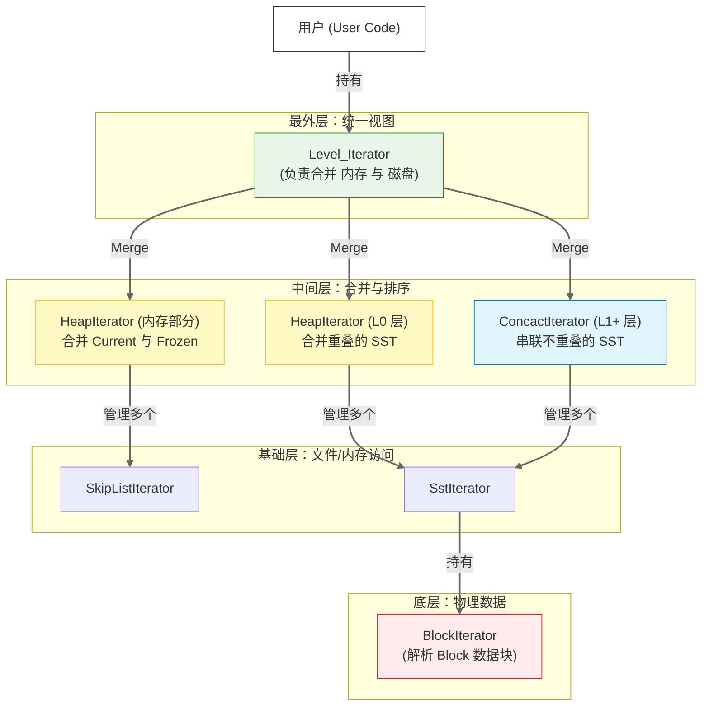
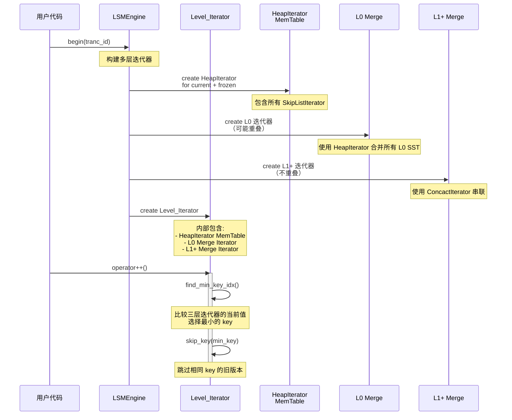
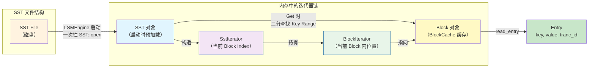
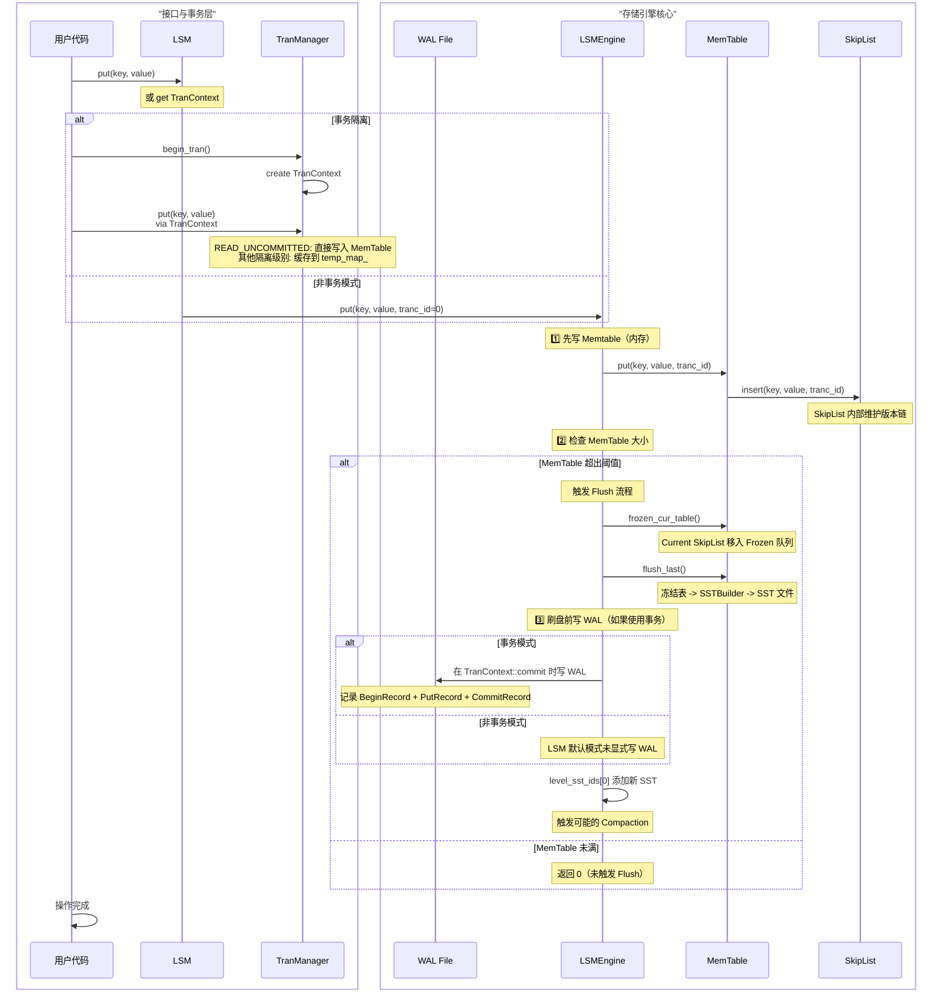
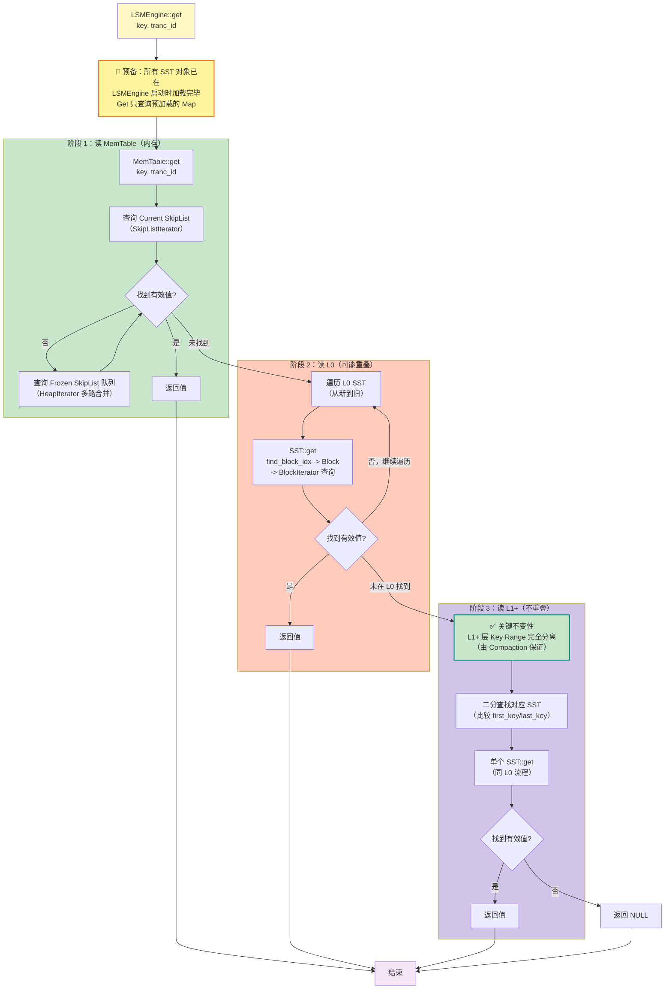
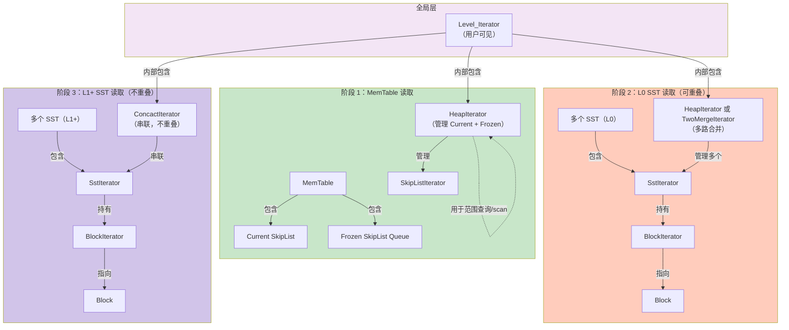
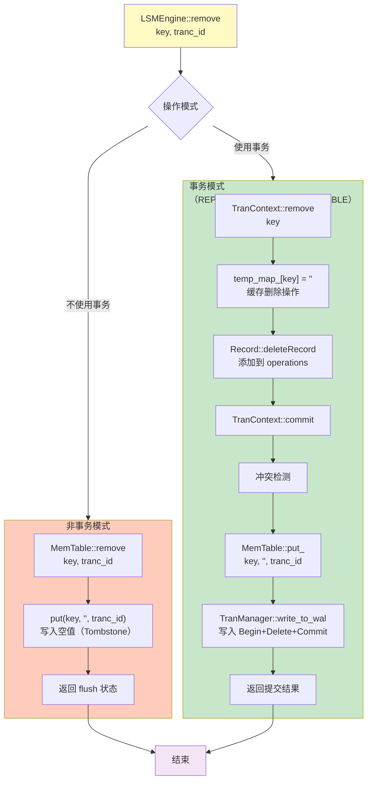
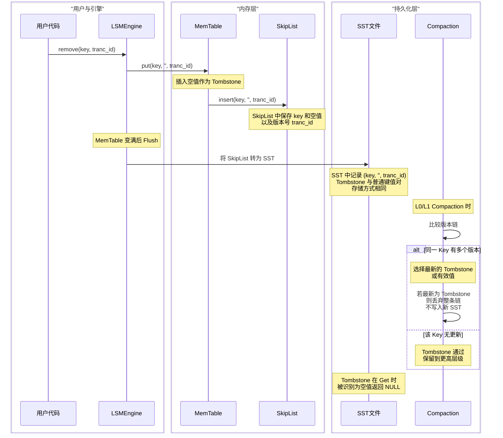

> 这是一份基于 C++ 项目视角的深度分析，专注于**数据结构设计**和**数据流向**两个角度，忽略事务隔离级别、缓存池细节和布隆过滤器。

---

## 第一部分：静态结构与层级关系

### 宏观架构图

Tiny-LSM 采用**经典的 LSM Tree 分层架构**，由内存组件（MemTable）和多层磁盘组件（SST Level 0 到 Level N）组成。WAL（Write-Ahead Log）贯穿写入流程始终。

**关键组件说明：**

| 组件 | 位置     | 职责                                          | 指针类型              |
| ------ | ---------- | ----------------------------------------------- | ----------------------- |
| `LSMEngine`     | 核心引擎 | 管理 MemTable、SST、编码、压缩流程            | `shared_ptr<LSMEngine>`                      |
| `MemTable`     | 内存     | 持有 Current SkipList 和 Frozen SkipList 队列 | 成员变量              |
| `Current SkipList`     | 内存     | 接收当前写入的键值对                          | `shared_ptr<SkipList>`                      |
| `Frozen SkipList List`     | 内存     | 冻结的已满表队列，等待 Flush                  | `list<shared_ptr<SkipList>>`                      |
| `SST (Level 0~N)`     | 磁盘     | 分层存储的排序集合表                          | `shared_ptr<SST>` 存于 `ssts` Map            |
| `WAL`     | 磁盘     | 记录所有写操作以支持崩溃恢复                  | 通过 `TranManager` 访问            |
| `Block`     | 磁盘     | SST 内部的数据单元                            | `shared_ptr<Block>` 通过 BlockCache 管理 |
| `BlockCache`     | 内存     | 缓存最近访问的 Block                          | `shared_ptr<BlockCache>`                      |

---

### 迭代器设计图

Tiny-LSM 使用**多层迭代器组合**模式。从最底层的 `BlockIterator` 开始，逐级封装成更高层的迭代器，最终形成用户可见的全局 `Level_Iterator`。

#### 迭代器继承关系与组合结构

#### 迭代器组合流程图（全量 Scan 场景）

当执行 `LSMEngine::begin(tranc_id)` 进行全量扫描时，迭代器的构建与使用流程如下：

#### BlockIterator 与 SstIterator 的关系

---

## 第二部分：核心操作的数据流向

### Put 流程

#### 完整的 Put 操作时序图

#### Put 核心流程说明

| 步骤 | 组件        | 操作               | 说明                            |
| ------ | ------------- | -------------------- | --------------------------------- |
| 1    | LSMEngine   | `put(key, value, tranc_id)`                   | 接收 Put 请求                   |
| 2    | MemTable    | `put(key, value, tranc_id)`                   | 写入 Current SkipList           |
| 3    | MemTable    | 检查大小           | 若超过阈值，冻结 Current        |
| 4    | MemTable    | 冻结与刷盘         | 冻结表转为 SST 文件             |
| 5    | WAL（可选） | 记录操作           | 在 TranContext::commit 时写入   |
| 6    | LSMEngine   | 更新 level_sst_ids | SST 添加到 Level 0              |
| 7    | LSMEngine   | 压缩判定           | 若 L0 超过阈值，触发 Compaction |

**关键点：**

- **WAL 与 Memtable 顺序**：在内存模式下，Memtable 先写；在事务模式下，`TranContext::commit` 先写 WAL，后写 Memtable。
- **Tombstone（删除标记）** ：Remove 操作本质上也是 Put，值为空字符串，标记删除。
- **内存指针**：`Current SkipList` 是 `shared_ptr<SkipList>`，超大后冻结并添加至 Frozen 队列。

---

### Get 流程

#### Get 的多阶段读取流程

#### Get 中的迭代器使用详解

> **关键架构洞察**：
>
> - **Read Path（简单 Get）中只使用 HeapIterator 和 ConcactIterator**，不涉及 TwoMergeIterator
> - **TwoMergeIterator 专用于 Compaction 和范围查询**，属于写路径或高级查询的优化
> - **SST 对象预加载**：LSMEngine 启动时一次性加载所有 SST 元数据，Get 操作只做查询，避免重复 I/O
> - **L1+ 不重叠保证**：是 ConcactIterator 能正确工作的前提，也是 LSM Tree 性能的关键

#### 关键问题解答

**Q1: TwoMergeIterator 和 HeapIterator 分别在什么场景下介入？**

| 迭代器 | 场景             | 原因                                                           | 在 Read Path 中使用？         |
| -------- | ------------------ | ---------------------------------------------------------------- | ------------------------------- |
| **TwoMergeIterator**       | 合并两个有序序列 | Compaction 中合并 Lx 和 Ly；范围查询中合并 MemTable 和磁盘部分 | ❌ **否**（仅 Compaction/范围查询） |
| **HeapIterator**       | 合并多个有序序列 | 多路堆合并：L0 中多个重叠 SST、MemTable 的 Current + Frozen    | ✅ **是**（L0、MemTable）           |
| **ConcactIterator**       | 串联多个**不重叠**序列     | L1+ 中的 SST 串联（已保证无重叠，无需比较）                    | ✅ **是**（L1+ 层）                 |

**Q2: Get 流程中如何保证 MVCC 可见性？**

- 每个 Entry 都带有 `tranc_id` 时间戳
- `BlockIterator` 和 `SstIterator` 在遍历时，通过 `skip_by_tranc_id()` 跳过不可见版本
- `HeapIterator` 通过 `select_visible_version()` 在多个版本中选择对当前事务可见的版本

**Q3: Block 是如何被缓存和释放的？**

- SST 读取 Block 时调用 `SST::read_block(block_idx)`
- 请求被转发到 `BlockCache`
- BlockCache 采用 LRU 策略，超出容量时自动淘汰旧 Block
- Block 通过 `shared_ptr` 管理生命周期

**Q4: SST 对象何时加载？Get 流程中是否每次都打开 SST 文件？**

- **SST 对象加载时机**：LSMEngine 启动时（构造函数中）一次性遍历数据目录，通过 `SST::open()` 加载所有 SST 文件的元数据（索引、Footer）到内存
- **Get 流程中的查询**：直接从预加载的 `ssts` Map 中获取 SST 对象，然后查询其索引和 Block，**不需要重复打开文件**
- **性能影响**：这种设计大幅减少 I/O，只需在启动时加载一次，之后的 Block 访问通过 BlockCache 进一步优化

**Q5: ConcactIterator 使用的关键前提是什么？**

系统**必须严格保证 L1+ 层 SST 之间的 Key Range 不重叠**，这是 Compaction 算法必须维护的核心不变性（Invariant）。如果违反此不变性，ConcactIterator 会导致：

- **数据漏读**：相同 Key 存在于多个 SST，但由于串联特性只扫描第一个 SST，后续版本无法被访问
- **版本混乱**：多版本控制（MVCC）在不重叠的假设下工作，违反会导致可见性错误

因此，**L1+ 层的分离性（Separation）是 LSM Tree 架构的关键约束**，由 Compaction 算法严格保证。

---

### Remove 流程

#### Remove 操作的实现原理

#### Tombstone（墓碑）的生命周期

#### Remove 核心流程说明

| 步骤 | 组件        | 操作               | 说明                                      |
| ------ | ------------- | -------------------- | ------------------------------------------- |
| 1    | LSMEngine   | `remove(key, tranc_id)`                   | 接收 Remove 请求                          |
| 2    | MemTable    | `put(key, '', tranc_id)`                   | 写入空值（Tombstone）                     |
| 3    | SkipList    | 版本链管理         | 与普通 Put 相同，空值表示删除             |
| 4    | WAL（可选） | 记录删除操作       | TranContext 中记录为 `deleteRecord`                     |
| 5    | 刷盘        | SST 存储 Tombstone | Tombstone 以空值形式保存                  |
| 6    | Compaction  | 清理 Tombstone     | 在最新版本为 Tombstone 时，丢弃整条版本链 |
| 7    | Get 流程    | 识别空值           | 返回 NULL 而非错误                        |

**关键点：**

- **本质上是 Put**：Remove 就是 `put(key, '', tranc_id)`
- **Tombstone 标记**：空字符串 `''` 表示已删除
- **MVCC 兼容**：多个事务可看到不同版本的 Tombstone
- **压缩时清理**：Compaction 在最新版本为 Tombstone 时，整条版本链被丢弃

---

## 总结与设计要点

### 数据结构设计原则

1. **内存层（MemTable）**

   - 采用 SkipList 实现，支持 O(log n) 查询和范围扫描
   - Current + Frozen 队列设计，支持无锁或低锁并发
   - 通过 `shared_ptr` 管理生命周期
2. **磁盘层（SST）**

   - 多层不同特性：L0 可重叠，L1+ 不重叠
   - Block 粒度存储，支持部分读取
   - BlockCache 缓存热数据
   - **SST 对象预加载**：启动时一次性加载所有 SST 元数据到内存，减少 Get 流程 I/O
3. **迭代器体系**

   - BaseIterator 抽象接口，支持多态
   - 自底向上：BlockIterator → SstIterator → 合并迭代器 → Level_Iterator
   - 合并策略：

     - **HeapIterator（堆合并）** ：用于 Read Path 合并多个有序序列（L0、MemTable）
     - **TwoMergeIterator（双路合并）** ：仅用于 Compaction 和范围查询，优化两层 SST 的合并
     - **ConcactIterator（串联）** ：用于 L1+ 不重叠层的零成本串联
4. **数据流向**

   - **写入路径**：User → LSMEngine → MemTable → SkipList → (Flush) → SST → (Compaction) → 高层 SST
   - **读取路径**：User → Level_Iterator → MemTable/L0/L1+ 多层查询 → 返回（所有 SST 对象已预加载）
   - **删除路径**：Remove = Put(tombstone)，通过版本控制实现逻辑删除

### C++ 内存管理特点

- **shared_ptr**：用于所有共享所有权的对象（SST、Block、SkipList）
- **unique_ptr**：用于独占所有权的组件（如 FileObj）
- **stack allocation**：迭代器通常栈分配，减少堆分配开销
- **RAII**：所有资源通过构析函数自动释放

### 架构不变性（Invariants）

| 不变性 | 位置     | 作用                                        | 维护者                        |
| -------- | ---------- | --------------------------------------------- | ------------------------------- |
| **L0 可重叠**       | Level 0  | 快速接收新数据，无需排序                    | Flush 过程                    |
| **L1+ 不重叠**       | Level 1~ | 支持 ConcactIterator 高效串联，二分查找定位 | Compaction 过程               |
| **同层 SST 有序**       | 所有层   | 支持二分查找和迭代器组合                    | SST 构建算法                  |
| **版本可见性**       | 所有层   | MVCC 支持，tranc_id 时间戳控制              | 所有迭代器的 skip_by_tranc_id |

---

## 附录：术语速查

| 术语            | 中文           | 解释                                                 |
| ----------------- | ---------------- | ------------------------------------------------------ |
| LSM Tree        | 日志结构合并树 | 分层存储结构，内存层 + 多层磁盘层                    |
| MemTable        | 内存表         | 内存中的活跃键值存储，采用 SkipList 实现             |
| SST             | 排序字符串表   | 磁盘上的排序数据单元                                 |
| Block           | 块             | SST 内部的数据单元，通常 4KB 大小                    |
| Tombstone       | 墓碑           | 标记删除的特殊键值（空值），用于表示逻辑删除         |
| Compaction      | 压缩           | 后台任务，合并多层 SST 以提高查询效率和回收空间      |
| Level 0         | 0 层           | 新刷入的 SST，可能相互重叠                           |
| Level 1+        | 1+ 层          | 已排序的 SST 层，相同层内不重叠，相邻层也有分离      |
| MVCC            | 多版本并发控制 | 通过 tranc_id 时间戳管理版本，支持并发读写           |
| WAL             | 预写日志       | 崩溃恢复的日志，记录所有写操作                       |
| ConcactIterator | 串联迭代器     | （原项目拼写，应为 Concatenate）用于串联不重叠的 SST |
