> 本文深入探讨 Tiny-LSM 的事务管理、故障恢复和性能优化机制，涵盖 MVCC、WAL、Bloom Filter、BlockCache 和 Compaction 等关键子系统。

---

## 第一部分：事务子系统 (Transaction & MVCC)

### 1.1 事务架构概览

Tiny-LSM 采用**乐观并发控制（OCC）+ MVCC**架构，支持多种隔离级别。事务系统由三个核心组件组成：

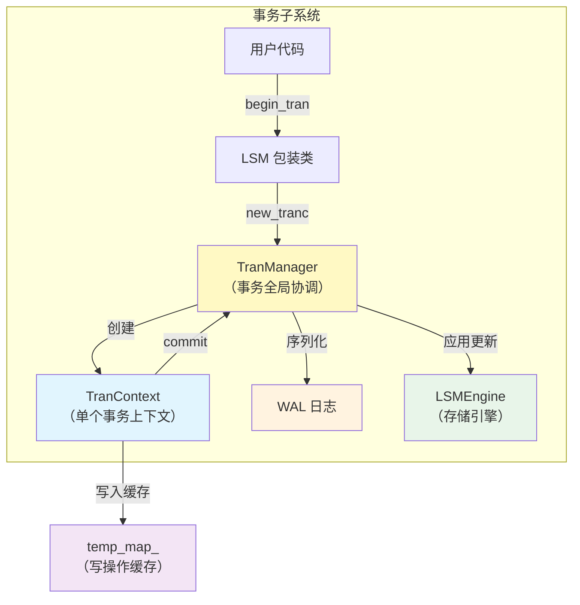

### 1.2 TranManager 与事务 ID 分配

```cpp
class TranManager {
private:
  std::atomic<uint64_t> nextTransactionId_ = 1;      // 全局递增
  std::atomic<uint64_t> max_flushed_tranc_id_ = 0;   // 已刷盘的最大 ID
  std::atomic<uint64_t> max_finished_tranc_id_ = 0;  // 已完成的最大 ID
  std::map<uint64_t, std::shared_ptr<TranContext>> activeTrans_;  // 活跃事务表
};
```

**关键设计**：

- **单调递增 tranc_id**：每个事务分配一个全局唯一的单调递增 ID，用作版本戳
- **原子操作**：使用 `std::atomic<uint64_t>` 保证无锁的 ID 分配
- **两层水位线**：

  - `max_flushed_tranc_id_`：已持久化到 SST 的最大事务 ID（冲突检测用）
  - `max_finished_tranc_id_`：已提交或回滚的最大事务 ID（WAL 清理用）

### 1.3 TranContext 的生命周期与缓冲设计

```cpp
class TranContext {
public:
  std::unordered_map<std::string, std::string> temp_map_;  // 写操作缓存
  std::vector<Record> operations;                           // WAL 日志序列
  enum IsolationLevel isolation_level_;
  
private:
  std::unordered_map<std::string, std::optional<...>> read_map_;      // 读集合（MVCC）
  std::unordered_map<std::string, std::optional<...>> rollback_map_;  // 回滚数据
};
```

#### 三种隔离级别的策略差异

| 隔离级别 | Put 行为                | Get 行为                 | Commit 冲突检测           |
| ---------- | ------------------------- | -------------------------- | --------------------------- |
| **READ_UNCOMMITTED**         | 直接写 MemTable（脏写） | 读最新版本               | 无                        |
| **READ_COMMITTED**         | 缓存到 temp_map_        | 每次从 MemTable 读取     | 写冲突检测                |
| **REPEATABLE_READ**         | 缓存到 temp_map_        | 缓存到 read_map_（快照） | 写冲突 + 读冲突检测       |
| **SERIALIZABLE**         | 缓存到 temp_map_        | 缓存到 read_map_（快照） | 严格冲突检测 + 幽灵读防护 |

### 1.4 事务完整生命周期

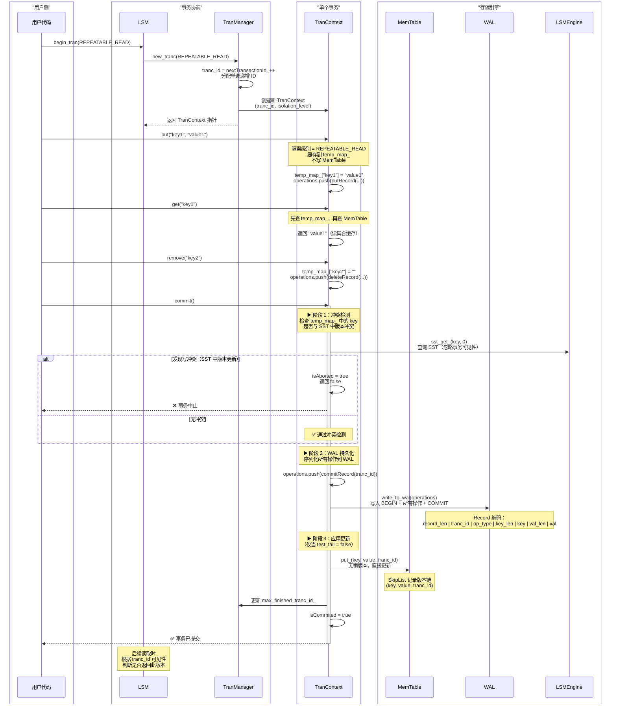

### 1.5 Record 编码格式与 WAL 持久化

#### Record 的内存布局

```
┌─────────────────────────────────────────────────────┐
│                  CREATE / COMMIT / ROLLBACK          │
├─────────────────────────────────────────────────────┤
│ record_len (2B) │ tranc_id (8B) │ op_type (1B/4B)  │
│ 总长度          │ 事务 ID       │ 操作类型         │
└─────────────────────────────────────────────────────┘

┌──────────────────────────────────────────────────────────────────┐
│                    PUT / DELETE 操作                             │
├──────────────────────────────────────────────────────────────────┤
│ record_len │ tranc_id │ op_type │ key_len │ key │ value_len │ value │
│ (2B)       │ (8B)     │ (1/4B)  │ (2B)    │ ... │ (2B)      │ ...   │
└──────────────────────────────────────────────────────────────────┘
```

**编码流程**（src/wal/record.cpp）：

1. 计算总长度 record_len = 2 + 8 + 1 + 2 + key_size + 2 + value_size
2. memcpy 按顺序写入各字段
3. 返回二进制 vector<uint8_t>

**解码流程**：

1. 读取 record_len，确定记录边界
2. 依次 memcpy 提取 tranc_id、op_type、key、value
3. 支持流式解码（pos 指针逐步推进）

#### WAL 缓冲与刷新

```cpp
class WAL {
private:
  std::vector<Record> log_buffer_;  // 内存缓冲
  size_t buffer_size_;              // 缓冲容量（如 64KB）
  
public:
  void log(const std::vector<Record> &records, bool force_flush = false);
  void flush();  // 将缓冲写入磁盘
};
```

**策略**：

- **批量缓冲**：多个事务的 Record 累积到缓冲区
- **异步刷新**：后台线程定期 flush，或达到大小阈值
- **强制刷新**：commit 时设置 force_flush = true，确保持久化

### 1.6 MVCC 可见性规则

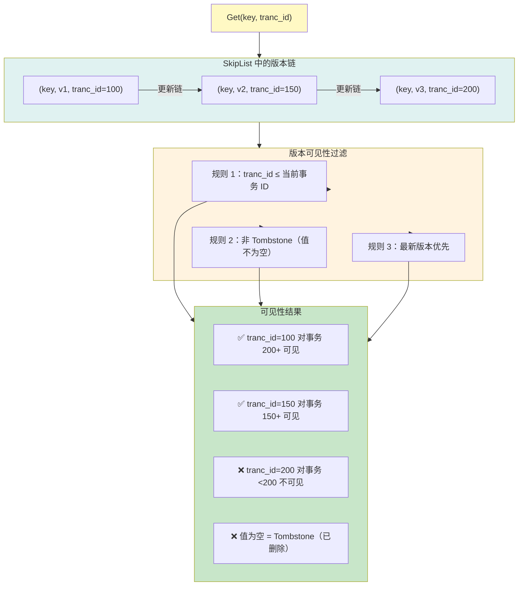

**核心伪代码**（在 BlockIterator/SstIterator 中实现）：

```cpp
std::optional<std::string> BlockIterator::skip_by_tranc_id() {
  while (is_valid()) {
    // 获取当前 entry 的版本戳
    uint64_t entry_tranc_id = get_tranc_id_at(current_index);
    
    if (entry_tranc_id <= query_tranc_id) {
      // ✅ 版本对当前事务可见
      std::string value = get_value_at(current_index);
      if (value.size() > 0) {
        // 非 Tombstone，返回
        return value;
      } else {
        // Tombstone，说明 key 已被删除，继续查前一版本
        ++current_index;  // 或从其他层查询
        return std::nullopt;
      }
    } else {
      // ❌ 版本对当前事务不可见（太新了）
      ++current_index;  // 跳过，查更早版本
    }
  }
  return std::nullopt;  // 无可见版本
}
```

### 1.7 启动与恢复流程（Crash Recovery）

WAL 的核心价值在于系统崩溃后的恢复。当 LSM 重启时，需要通过 WAL 将未持久化的数据重新加载到 MemTable 中。

#### 恢复流程图

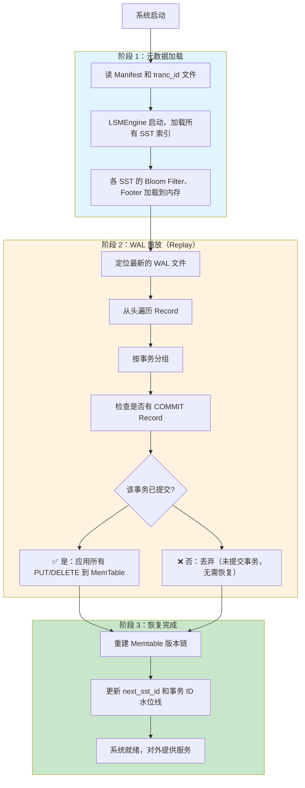

#### 恢复的核心代码（LSM 构造函数）

```cpp
LSM::LSM(std::string path) {
  // 1. 初始化引擎和事务管理
  engine = std::make_shared<LSMEngine>(path);
  tran_manager_ = std::make_shared<TranManager>(path);
  tran_manager_->set_engine(engine);
  
  // 2. WAL 重放：check_recover() 读取 WAL，按事务分组
  auto recover_map = tran_manager_->check_recover();
  
  // 3. 逐个事务处理
  for (auto &[tran_id, records] : recover_map) {
    bool has_commit = false;
    
    // 检查该事务是否已提交
    for (auto &record : records) {
      if (record.getOperationType() == OperationType::COMMIT) {
        has_commit = true;
        break;
      }
    }
    
    // 若已提交，重放所有操作
    if (has_commit) {
      for (auto &record : records) {
        if (record.getOperationType() == OperationType::PUT) {
          engine->memtable.put(record.getKey(), record.getValue(), 
                              record.getTrancId());
        } else if (record.getOperationType() == OperationType::DELETE) {
          engine->memtable.remove(record.getKey(), record.getTrancId());
        }
      }
    }
    // 若未提交，跳过（符合 ACID 中的原子性）
  }
}
```

#### 关键设计点

| 阶段 | 设计要点                              | 原因                               |
| ------ | --------------------------------------- | ------------------------------------ |
| **COMMIT 检查**     | 只有包含 COMMIT Record 的事务才被重放 | 保证原子性：未提交的更新不会被应用 |
| **顺序重放**     | 按 WAL 中的顺序应用 PUT/DELETE        | 保证因果一致性                     |
| **版本戳保留**     | 使用 record.getTrancId() 而非新 ID    | 保证恢复后的版本链与原始一致       |
| **MemTable 更新**     | 直接调用 put/remove（无缓冲）         | 避免丢失恢复的数据                 |

#### 故障场景分析

```
场景 1：Commit 前崩溃
─────────────────────────────────────
WAL: BEGIN[T100] PUT(k1,v1) ← 崩溃
恢复: 未找到 COMMIT，T100 被忽略
结果: ✅ 数据丢失，符合预期（事务未提交）

场景 2：Commit 后、Flush 前崩溃
─────────────────────────────────────
WAL: BEGIN[T100] PUT(k1,v1) COMMIT[T100] ← 崩溃
恢复: 找到 COMMIT，重放 PUT(k1,v1)
结果: ✅ 数据恢复到 Memtable（尚未 Flush 到 SST）

场景 3：完全恢复（正常运行）
─────────────────────────────────────
WAL: BEGIN[T100] PUT(k1,v1) COMMIT[T100]
恢复: 重放数据到 Memtable
后续: Memtable 满时 Flush 到 SST，WAL 可清理
结果: ✅ 完整恢复，系统可继续正常运行
```

---

## 第二部分：读取优化链路 (Bloom Filter & Cache)

### 2.1 Bloom Filter 的集成位置

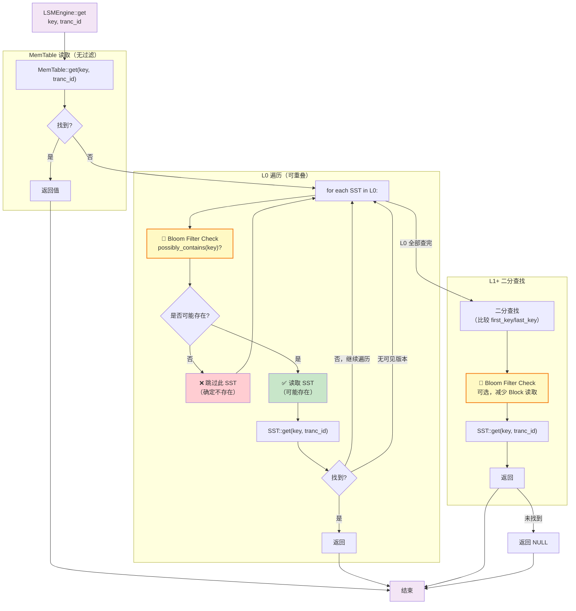

### 2.2 Bloom Filter 原理与参数

```cpp
class BloomFilter {
private:
  size_t expected_elements_;     // 预期元素数量
  double false_positive_rate_;   // 允许的假阳性率（如 0.01）
  size_t num_bits_;              // 位数组大小 = expected_elements * ln(2)^2 / ln(FPR)
  size_t num_hashes_;            // 哈希函数数量 = num_bits * ln(2) / expected_elements
  std::vector<bool> bits_;       // 位数组
  
public:
  void add(const std::string &key);
  bool possibly_contains(const std::string &key) const;
};
```

#### 参数示例

对于 10,000 个元素、假阳性率 1%：

- **位数组大小** = 10,000 × 9.58 ≈ 95,800 bits ≈ 12 KB
- **哈希函数数** = 95,800 × 0.693 / 10,000 ≈ 7 个
- **查询成本** = 7 次哈希计算（远小于磁盘 I/O）

#### 集成点详解

| 位置 | 时机           | 作用                           | 节省成本             |
| ------ | ---------------- | -------------------------------- | ---------------------- |
| **SST 构建**     | 写入 Block 时  | 每个 SST 维护一个 Bloom Filter | -                    |
| **L0 遍历**     | 读取 L0 SST 前 | 快速排除不包含 key 的 SST      | 避免解析 Block       |
| **L1+ 二分**     | 可选优化       | 在获取 Block 前做二次检查      | 减少 BlockCache 竞争 |

#### Bloom Filter 生命周期与内存常驻

**关键设计**：Bloom Filter 的数据块（通常 12-64KB）存储在 SST 文件末尾，但**被加载到内存后常驻不卸载**。

```
SST 文件结构：
┌────────────────────────────────────┐
│     Data Block Section             │  ← 实际 KV 数据
├────────────────────────────────────┤
│     Metadata（Footer）             │  ← SST 索引
├────────────────────────────────────┤
│  📍 Bloom Filter（12-64KB）        │  ← 位数组（常驻内存）
└────────────────────────────────────┘
```

**生命周期**：

1. **SST 生成时**：SSTBuilder 累积所有 key，编码生成 Bloom Filter 数据块，序列化到文件
2. **SST::open() 时**：系统启动或 Compaction 完成后，读取 SST 文件，将 Bloom Filter 加载到内存（附着在 SST 对象的 `bloom_filter_` 成员）
3. **Get 查询时**：直接调用 `bloom_filter_->possibly_contains(key)`，操作完全在内存进行，**无需磁盘 I/O**
4. **LSMEngine 生命周期结束**：随 SST 对象析构而释放

**性能含义**：

- **查询成本** = 7 次哈希计算（≈ 微秒级）
- **无磁盘 I/O**：不像 Block 需要从缓存或磁盘读取
- **与 BlockCache 互补**：Bloom Filter 快速排除 → BlockCache 缓存热 Block → 整体读延迟大幅降低

### 2.3 BlockCache 的 LRU-K 实现

```cpp
class BlockCache {
private:
  size_t capacity_;                    // 缓存容量（如 100 个 Block）
  size_t k_;                           // LRU-K 中的 K 值
  std::list<CacheItem> cache_list_greater_k;  // K 次以上访问的项
  std::list<CacheItem> cache_list_less_k;     // K 次以下访问的项
  
  struct CacheItem {
    int sst_id;
    int block_id;
    std::shared_ptr<Block> cache_block;
    uint64_t access_count;             // 访问计数
  };
};
```

#### LRU-K 的淘汰策略

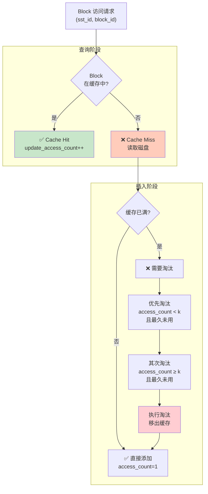

#### BlockCache 与 Bloom Filter 的协同

```
SST 读取流程：
1. Get(key, tranc_id)
   ├─ Bloom Filter::possibly_contains(key)
   │  └─ 返回 false → 返回 NULL（节省 I/O）
   │  └─ 返回 true  → 继续读 Block
   │
   └─ SST::find_block_idx(key) → 定位 Block ID
      └─ BlockCache::get(sst_id, block_id)
         ├─ Hit   → 返回缓存的 Block 对象
         ├─ Miss  → 从磁盘读取 Block
         │         ├─ 反序列化 Block 数据
         │         ├─ 插入 BlockCache（LRU-K）
         │         └─ 返回 Block 对象
         └─ 解析 Block → 查询 (key, value, tranc_id)
```

### 2.4 缓存效率指标

```cpp
double BlockCache::hit_rate() const {
  // 命中率 = 命中次数 / 总请求次数
  return (double)hit_requests_ / total_requests_;
}
```

**性能影响示例**：

- **hit_rate = 90%** ：平均延迟 = 0.9 × (内存访问 10μs) + 0.1 × (磁盘读 5ms) ≈ 0.5ms
- **hit_rate = 50%** ：平均延迟 = 0.5 × 10μs + 0.5 × 5ms ≈ 2.5ms（5 倍差异）

---

## 第三部分：SST 压缩机制 (Compaction)

### 3.1 压缩策略选择

Tiny-LSM 采用 **Leveling 策略**（类似 LevelDB），而非 Tiering（类似 RocksDB）。

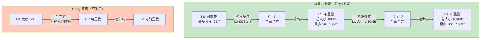

**Leveling vs Tiering**：

| 指标 | Leveling             | Tiering            |
| ------ | ---------------------- | -------------------- |
| **L1+ 重叠**     | 不重叠               | 可能重叠           |
| **读放大**     | 低（只需查一个 SST） | 高（可能查多个层） |
| **写放大**     | 高（全量合并）       | 低（增量合并）     |
| **空间放大**     | 低（及时删除）       | 中高（保留历史）   |
| **适用场景**     | 读多写少             | 写多读少           |

### 3.2 压缩触发条件

```cpp
// src/lsm/engine.cpp 中的 flush() 函数
uint64_t LSMEngine::flush() {
  // ...
  
  // 触发条件 1：L0 SST 数量超限
  if (level_sst_ids[0].size() >= getLsmSstLevelRatio()) {  // 如 4
    full_compact(0);  // L0 + L1 合并
  }
  
  // 触发条件 2：L1+ 大小超限
  for (size_t level = 1; level <= cur_max_level; level++) {
    if (calc_level_size(level) >= get_sst_size(level)) {
      full_compact(level);  // Lx + L(x+1) 合并
    }
  }
}
```

**阈值配置**（config.toml）：

- `L0 阈值` = 4 SST
- `L1 大小` = 10 MB，`L2` = 100 MB，...（每层 10 倍递进）
- `LsmSstLevelRatio` = 10（层级大小递增因子）

### 3.3 一次 Compaction 的完整流程

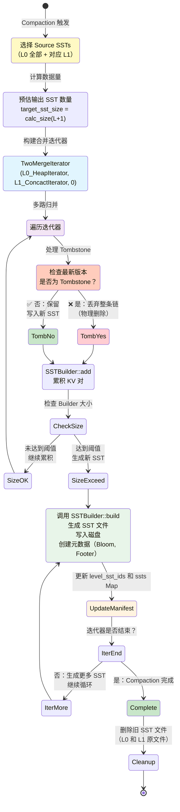

### 3.4 关键代码段分析

#### L0 + L1 Compaction（完全合并）

```cpp
std::vector<std::shared_ptr<SST>>
LSMEngine::full_l0_l1_compact(std::vector<size_t> &l0_ids, 
                               std::vector<size_t> &l1_ids) {
  // 1. 构建 L0 迭代器（多个 SST 可能重叠，使用 HeapIterator 多路合并）
  std::vector<SstIterator> l0_iters;
  for (auto id : l0_ids) {
    l0_iters.push_back(ssts[id]->begin(0));  // tranc_id=0 表示忽略版本控制
  }
  auto [l0_begin, l0_end] = SstIterator::merge_sst_iterator(l0_iters, 0);
  std::shared_ptr<HeapIterator> l0_begin_ptr = 
      std::make_shared<HeapIterator>(std::move(l0_begin));
  
  // 2. 构建 L1 迭代器（SST 不重叠，使用 ConcactIterator 串联）
  std::vector<std::shared_ptr<SST>> l1_ssts;
  for (auto id : l1_ids) {
    l1_ssts.push_back(ssts[id]);
  }
  std::shared_ptr<ConcactIterator> l1_begin_ptr =
      std::make_shared<ConcactIterator>(l1_ssts, 0);
  
  // 3. 双路合并（L0 和 L1 的有序流）
  TwoMergeIterator l0_l1_begin(l0_begin_ptr, l1_begin_ptr, 0);
  
  // 4. 写入新 SST（自动处理 Tombstone 清理）
  return gen_sst_from_iter(l0_l1_begin, 
                           getLsmPerMemSizeLimit() * getLsmSstLevelRatio(),
                           1);  // 目标 level = 1
}
```

 **🔑 关键设计点：SST ID 的全局唯一性**

在 `gen_sst_from_iter` 中创建新 SST 时：

```cpp
size_t sst_id = next_sst_id++;  // ⚠️ 全局递增，而非层级内的下标
```

**为什么必须全局唯一**：

- BlockCache 的 Key = `(sst_id, block_id)`
- 如果 sst_id 只是层级内下标（例如 L0 的第 0 个文件和 L1 的第 0 个文件都用 ID=0），会导致**缓存键冲突**
- 示例：

  ```
  L0[0] 的 Block 0 → Key = (0, 0) → 缓存项 A
  L1[0] 的 Block 0 → Key = (0, 0) → 缓存项 B（覆盖 A！）
  错误：L0 的数据被意外替换
  ```

**正确实现**：

- `next_sst_id` 是 LSMEngine 的全局计数器
- 每次生成 SST，递增后分配一个全局唯一的 ID（如 1, 2, 3, ..., 100, 101, ...）
- BlockCache 中的 (sst_id, block_id) 对永远不会冲突

#### Tombstone 处理（物理删除）

```cpp
std::vector<std::shared_ptr<SST>>
LSMEngine::gen_sst_from_iter(BaseIterator &iter, size_t target_sst_size,
                              size_t target_level) {
  std::vector<std::shared_ptr<SST>> new_ssts;
  SSTBuilder builder(...);
  
  while (iter.is_valid() && !iter.is_end()) {
    auto kv = *iter;
    
    // 关键判断：是否为 Tombstone（空值）
    if (kv.second.size() == 0) {
      // Tombstone：在 Compaction 最后一层可以物理删除
      if (target_level >= cur_max_level) {
        // 最后一层：跳过 Tombstone，执行物理删除
        ++iter;
        continue;
      } else {
        // 非最后一层：保留 Tombstone（供后续 Compaction 查询）
        builder.add(kv.first, kv.second, 0);
      }
    } else {
      // 正常 KV 对：直接添加
      builder.add(kv.first, kv.second, 0);
    }
    
    ++iter;
    
    // 构建 SST
    if (builder.estimated_size() >= target_sst_size) {
      size_t sst_id = next_sst_id++;
      auto new_sst = builder.build(sst_id, path, block_cache);
      new_ssts.push_back(new_sst);
      builder = SSTBuilder(...);  // 重置
    }
  }
  return new_ssts;
}
```

### 3.5 Compaction 的性能影响

#### 读写放大权衡

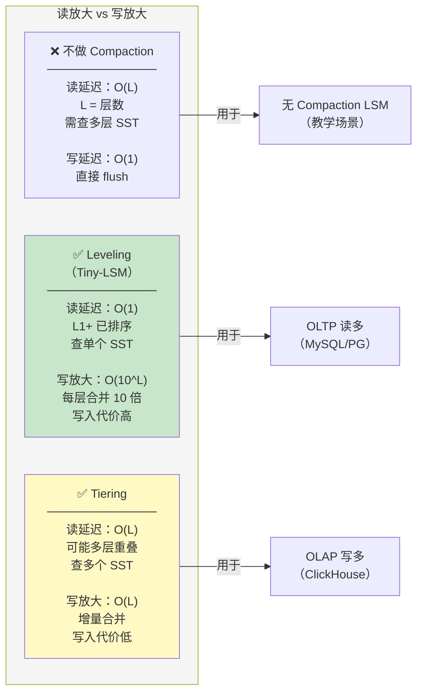

#### 写放大计算

假设配置：

- L0：4 个 SST，每个 1MB
- L1：10 个 SST，共 10MB
- Leveling 策略

**一次 Compaction 的写放大**：

```
输入数据量   = L0 (4MB) + L1 (10MB) = 14MB
输出数据量   = 新 L1 SST ≈ 14MB
写放大系数   = 输出 / 输入 ≈ 1

但是，L1 到 L2 又会触发 Compaction：
输入         = L1 (14MB) + L2 (100MB) = 114MB
输出         = 新 L2 (114MB)
写放大系数   = 114 / 14 ≈ 8

总体写放大   = 1 × 8 × 100 ≈ 800x（相比原始数据）
```

#### Tombstone 的空间回收效率

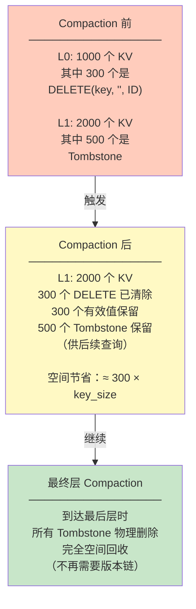

### 3.6 Compaction 与系统可用性

#### 后台压缩的挑战

| 挑战 | 影响                                    | 解决方案                  |
| ------ | ----------------------------------------- | --------------------------- |
| **写入延迟毛刺**     | Compaction 占用磁盘 I/O，读请求延迟上升 | 限流、优先级队列、多线程  |
| **内存溅射**     | 临时构建的大型迭代器占用内存            | 流式处理、分批合并        |
| **元数据一致性**     | Compaction 中途崩溃导致 SST 悬空        | WAL + Manifest 二阶段提交 |
| **UI 抖动**     | p99 延迟成倍增加                        | 自适应压缩、参数调优      |

---

## 总结：三层系统的协同

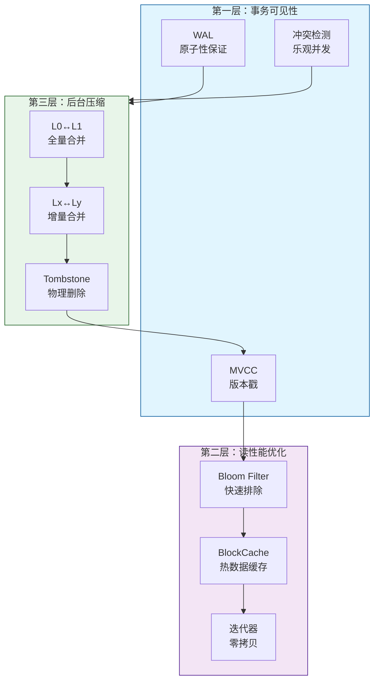

**协同效应**：

1. **事务层**为所有数据赋予版本戳，支持 MVCC 可见性
2. **优化层**利用 Bloom Filter 和 Cache 减少磁盘 I/O
3. **压缩层**在后台整理数据，删除历史版本和 Tombstone
4. **反馈循环**：WAL 记录的更新被应用到 Memtable → Flush 到 SST → Compaction 清理过期数据 → 下一个事务重复

这种分层架构使得 Tiny-LSM 能够同时支持**事务一致性、高效读取和后台清理**，是现代 LSM 存储引擎的典型设计模式。
